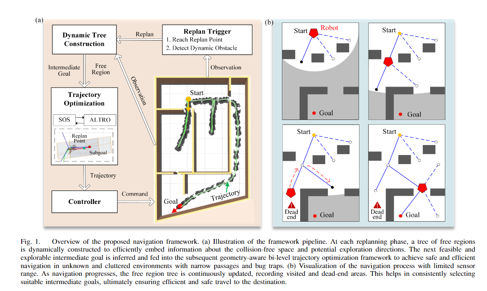

# FRTree Planner
<p align ="center">

</p>

FRTree planner is a robot navigation framework featuring a **Tree** of **F**ree **R**egion specifically designed for cluttered and unknown environments with narrow passages. 
The framework continuously incorporates real-time perceptive information to expand the tree toward explorable and traversable directions, with their geometric structure embedded in the sequence of extracted free regions. This dynamically constructed tree efficiently encodes the connectivity information of the free space, allowing the robot to select the most viable intermediate goals, navigate around dead-end situations, and avoid dynamic obstacles without relying on a prior map. 
Crucially, by examining the geometric relationship between the free regions and the robot along the tree, the framework can identify narrow passages that are suitable for the robot's specific geometry. By integrating this tree information with backend trajectory optimization, the framework generates robust and adaptable obstacle avoidance behaviors to navigate through narrow passages.
Through extensive simulations and real-world experiments, our framework demonstrates its advantages over benchmark methods in generating safe, efficient motion plans, enabling the robot to navigate effectively through highly cluttered and unknown terrains with narrow gaps.

## Example
<p align ="center">

### Maze 


---

### Forest 
Navigate from different start to goal in three area with different obstacle densities: Sparse Area (0.4 obstacle/m<sup>2</sup>): from S1 to G1; Moderately Dense Area (0.7 obstacle/m<sup>2</sup>): from S2 to G2; Dense Area (1.0 obstacle/m<sup>2</sup>): from S3 to G3.


---

### Real World 


---

</p>

## Implementation
Code will be released soon, and the folder structure is shown as below:
```
local_map
├── include
├── launch
├── rviz
└── src
planner_manage
├── include
│   ├── planner_manage
│   ├── Altro
│   └── SDPsolver
├── launch
├── maps
├── rviz
├── src
└── urdf
DecompROS
├── decomp_ros_msgs
├── decomp_ros_utils
├── decomp_test_node
└── DecompUtil
third_party
├── catkin_simple
├── geo_utils
├── modern_robotics
└── mosek

```
``local_map``manage the update of the tree; 

``planner_manage`` has a FSM to manage the pipeline of the framework (including the intermediate goal selecting and dynamic obstacle detection); 

``Altro`` and ``SDPsolver`` solve the trajectory optimization problem.
## Authors

- [@Yulin Li](yline@connect.ust.hk)

Feel free to contact me if you have any questions regarding the implementation of the algorithm.

